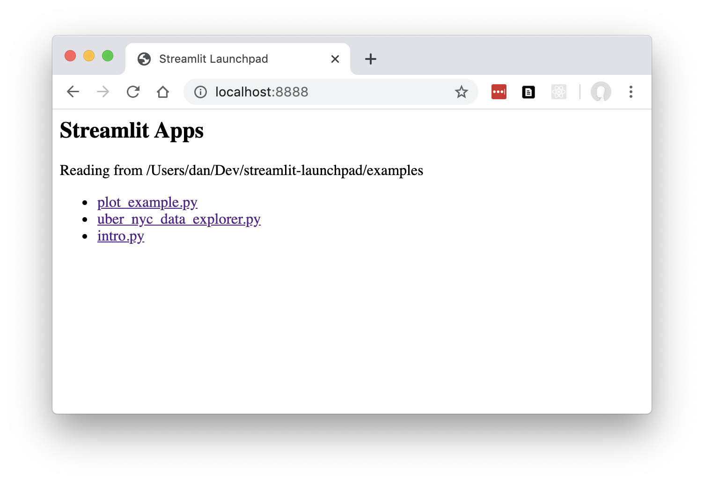

-------------------------------------------------------------------------------------------------

Test with binderHub:

https://mybinder.org/v2/gh/op07n/mygenericbinder2/master?urlpath=git-pull?repo=https://github.com/op07n/streamlit-launchpad

Change   app.listen(8888) to   app.listen(8080)  in  main.py

Add  '--server.enableCORS','False',    at  subprocess.Popen...   in main.py

Open terminal and type:

```
cd streamlit-launchpad

python main.py
```

For main access index page add /proxy/8080/  to url binderhub

Every option on main access index page show the port to use :

......................./proxy/8080/intro.py/

......................./proxy/8080/plot_example.py/

......................./proxy/8080/uber_nyc_data_explorer.py/

( /proxy/8085/  ,   /proxy/8086/  or  /proxy/8087/ )

-------------------------------------------------------------------------------------------------


# Streamlit Launchpad

Web launchpad to browse a folder containing multiple Streamlit applications (py files), with a central launchpad listing available apps so you can run them (if not already running) and view each in its own tab.

This is a very basic alpha version.

## Install and Run

Install using pip.

```
pip install streamlit-launchpad
```

Serves *.py as separate Streamlit applications from the folder supplied on the command line:

```
streamlit-launchpad ./examples
```

Then go to http://localhost:8888/ in your browser:



To run on a different port use:

```
streamlit-launchpad --port 8000 ./examples
```

## Development install

```
git clone https://github.com/ideonate/streamlit-launchpad.git
cd streamlit-launchpad

pip install -e .

streamlit-launchpad ./examples
```

To run directly in python: `python -m launchpad.main ./examples/`
